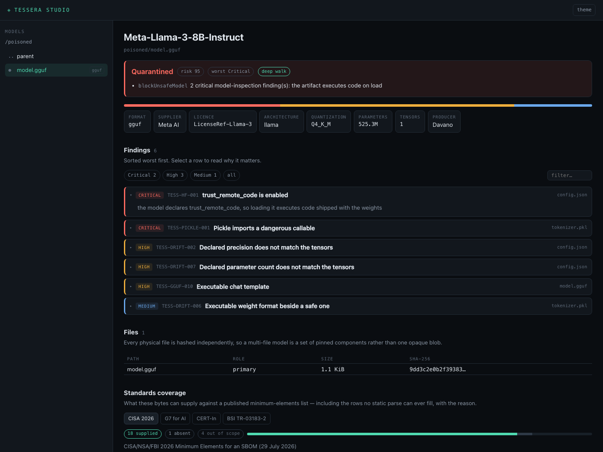

# Tessera

**Reads the bytes. Refuses the bad ones. Needs no network.**

Plenty of tools will write you an AI bill of materials. They read a model card,
a container label, a pod annotation — what the artifact *says about itself* —
and hand you a document. Tessera opens the file.

- **Depth.** GGUF, safetensors and ONNX are parsed directly and the tensor block
  is walked, so a file claiming `float16` over `Q4_K` weights is caught by
  arithmetic rather than trust. Everything beside them is walked too — pickle,
  PyTorch, Keras, SavedModel, NumPy, archives — because the formats parsed
  natively are the ones that *cannot* carry code. The attack is in the tokenizer
  pickle next door.
- **Refusal.** A verdict, an exit code, and a severity threshold, so a pipeline
  stops rather than files a report nobody reads.
- **No network.** No framework, no hub, no cluster, no telemetry, and zero
  third-party dependencies in the core. It runs in an enclave.

The same parse emits **CycloneDX 1.6/1.7**, **SPDX 3.0.1** and **SARIF 2.1.0**,
signs the result with a hybrid post-quantum signature, and can re-derive every
claim from the bytes months later to show the document is still true — including
documents other tools produced.

## Install

In a workflow:

```yaml
- uses: DAVANO-INNOVATION-LAB/tessera@v1.1.0
  with:
    path: ./model-dir
    fail-on: critical
```

Signatures are verified before the binary runs, and findings upload as
code-scanning alerts.

Or locally:

```bash
go install github.com/DAVANO-INNOVATION-LAB/tessera/cmd/tessera@latest
```

Releases carry signed checksums for Linux, macOS and Windows. A container image
is published to `ghcr.io/davano-innovation-lab/tessera`.

## Use

```bash
# Scan, document and judge in one pass
tessera scan ./model-dir --out ./boms

# Just the bill of materials
tessera bom ./model-dir --format cyclonedx,spdx,sarif --out ./boms

# Does this document still describe these bytes?
# Works on any CycloneDX ML-BOM, including ones other tools produced.
tessera verify model.cdx.json ./model-dir

# Coverage against a published minimum-elements list
tessera coverage ./model-dir --standard cisa-2026
```

Exit codes: `0` clean, `2` findings, `3` critical, `1` error. Gate a pipeline
with `--fail-on critical|high|medium`.

### Attested bills of materials

```bash
tessera-sign attest ./model-dir --key signing.key --out ./boms
tessera-sign verify-attestation boms/model.cdx.json.att.json \
  --public signing.pub --artifact ./model-dir
```

Signed with ML-DSA-87 *and* ECDSA P-384, both required. Verification checks the
signature **and** re-derives every claim from the artifact — a signed document
that has drifted from its bytes is a cryptographically impeccable lie.

### Hardening

A model can be hardened to a copy: the dangerous file removed, the unsafe flag
turned off, the original left untouched. The copy records what was changed and
what it came from, and that derivation travels into the bill of materials as
CycloneDX pedigree and an SPDX `descendantOf` edge — so a derivative says what
it was cut from, pinned by digest, rather than appearing to come from nowhere.

Changes a tool should not make silently are refused with the reason, not
performed quietly.

### Running it across a cluster

Tessera is a library, a command and a local interface. It has no opinion about
Kubernetes.

[**Cupel**](https://github.com/DAVANO-INNOVATION-LAB/cupel) is the operator that
runs it at fleet scale and enforces the answer: scheduled rescanning, promotion
between environments, a tamper-evident decision log, and an admission webhook
that refuses to let an unapproved model reach a running workload — the one thing
a command-line tool cannot do.

Cupel imports Tessera. Tessera does not know Cupel exists. Use Tessera to
inspect or document a model; add Cupel when the answer has to be enforced.

### The interface

```bash
tessera-studio /path/to/models
```

Browse models, read findings, harden a copy, download documents. A port
reachable beyond the machine requires a token or OIDC; loopback needs neither.



## Measured

Accuracy is graded against a labelled corpus in this repository, a third of it
traps — cases that look dangerous and are not, because a benchmark that only
measures what a tool finds rewards a tool that reports everything.

```bash
cd bench && go run ./cmd/tessera-bench run
```

The corpus is generated from specs rather than committed as binaries, so every
case is readable and the run is reproducible.

## Documentation

| | |
|---|---|
| [Findings](docs/findings.md) | every check, with severities |
| [Standards](docs/standards.md) | CISA 2026, G7, CERT-In, BSI coverage |
| [Embedding](docs/embedding.md) | library, CLI, C shared library, WebAssembly |
| [CI](docs/ci.md) | GitHub Action and pipeline use |
| [Design](docs/design.md) | why it works this way, and where it stops |
| [Studio](studio/README.md) | interface, authentication, OIDC |

## Licence

Apache-2.0.
